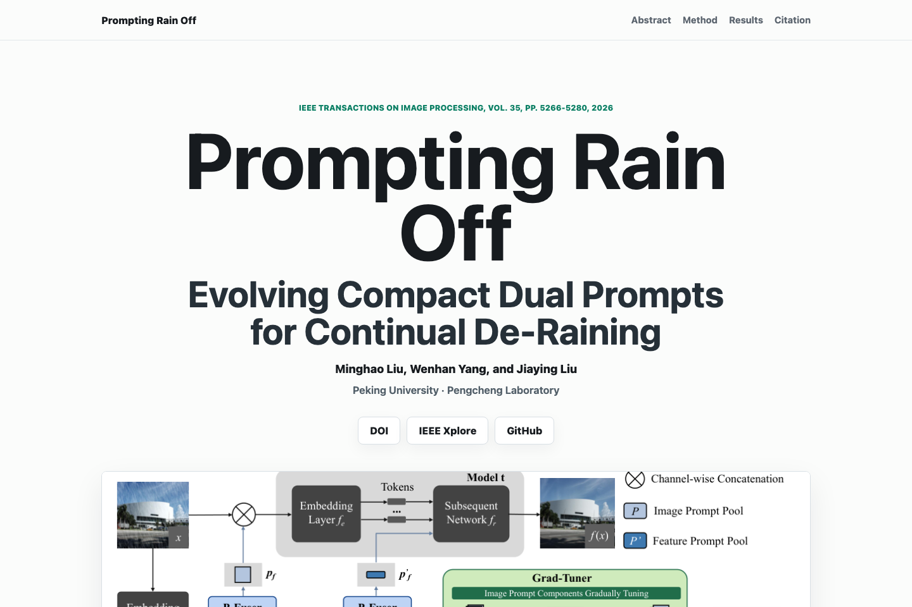

# Prompting Rain Off

Project page for **Prompting Rain Off: Evolving Compact Dual Prompts for Continual De-Raining**.

  

Image source: public GitHub Pages project page screenshot, [https://starymoon.github.io/Prompting-Rain-Off/](https://starymoon.github.io/Prompting-Rain-Off/). Captured on 2026-07-02.

- **Paper:** IEEE Transactions on Image Processing, vol. 35, pp. 5266-5280, 2026
- **Authors:** Minghao Liu, Wenhan Yang, and Jiaying Liu
- **DOI:** <https://doi.org/10.1109/TIP.2026.3689428>
- **IEEE Xplore:** <https://ieeexplore.ieee.org/document/11511395/>
- **Live page:** <https://starymoon.github.io/Prompting-Rain-Off/>

## What This Page Contains

- publication metadata and citation for the TIP 2026 paper;
- EcoDPL method overview, including image prompts, feature prompts, P-Fuser, and Grad-Tuner;
- paper first-page preview and method figures;
- continual deraining results and real-world comparison figures;
- links to DOI, IEEE Xplore, and the GitHub project.

This repository hosts the paper project page, visual comparisons, method figures, and release materials for EcoDPL.
